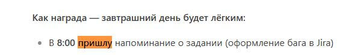

# DIP-2024-0820-03: Опечатка в глаголе "пришлю"

## 📋 Основная информация

**Проект:** DeepSeek Chat (DIP)  
**Тип:** Text Defect  
**Приоритет:** Low  
**Серьезность:** Trivial  
**Статус:** ✔️ Fixed (в версии 1.3)

**Окружение:**
- Версия: deepseek-chat-r1.2
- Платформа: Web/Mobile
- Язык: Русский

## 🐞 Описание бага
Обнаружена орфографическая ошибка в сообщении ИИ-наставника: неправильное написание глагола "пришлю".

## 🔍 Шаги воспроизведения
1. Открыть историю чата от 19.08.2024
2. Найти сообщение: "В 8:00 пришлу"
3. Сравнить с ожидаемым текстом

## 📊 Результаты
| Ожидаемый результат | Фактический результат |
|---------------------|-----------------------|
| "В 8:00 пришлю"     | "В 8:00 пришлу"       |

## 🎯 Влияние
- Снижение доверия к грамотности ИИ
- Локальное нарушение пользовательского опыта

## 🔧 Исправление
```python
# Патч в NLP-модели
if "пришлу" in generated_text:
    corrected_text = generated_text.replace("пришлу", "пришлю")
**Окружение:**
- Модель: DeepSeek Chat R1
- Версия: 1.2.0
- Платформа: Web-интерфейс
- Браузер: Chrome 115.0
- Язык интерфейса: Русский
- Время возникновения: 19.08.2024 14:30 UTC+3
## 📎 Приложения


